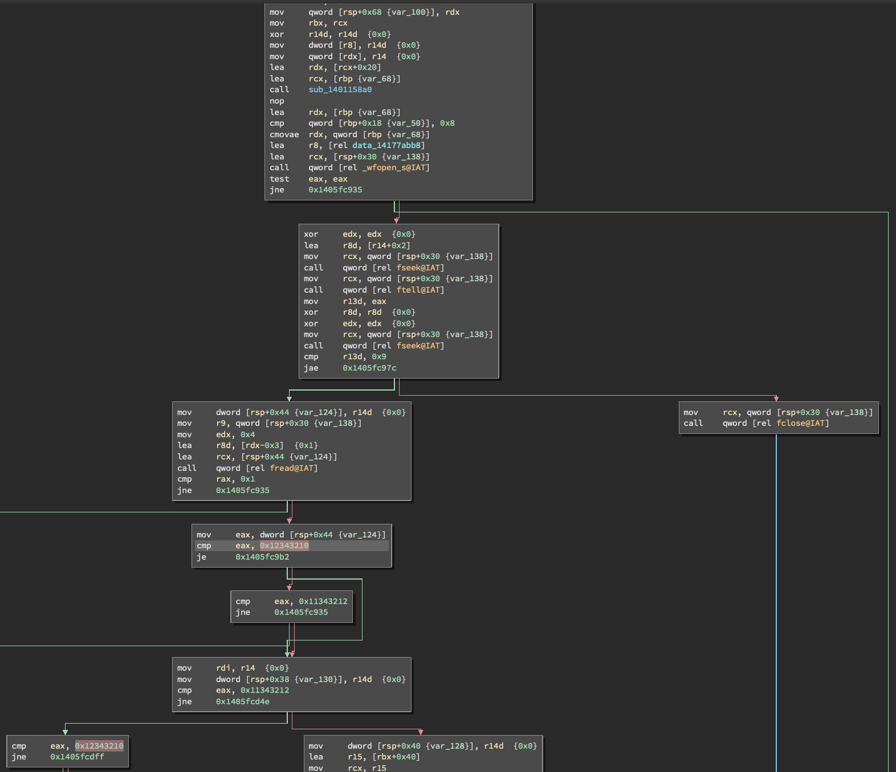
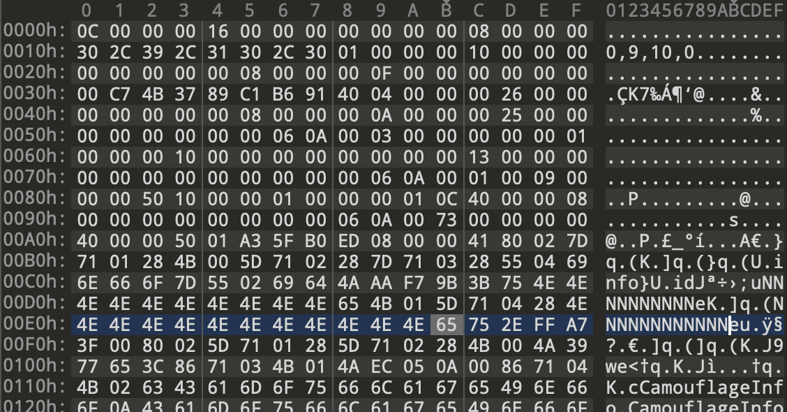

All notes are from WoWs version 0.9.10.

```
shasum WorldOfWarships64.exe
dd91f83d02104ae9fa39b11d37f3a6ab1162df43  WorldOfWarships64.exe
```

HLIL code and disassembly was done using Binary Ninja.

# .wowsreplay format protection

Based off [publicly documented info](http://web.archive.org/web/20180406013235/http://wiki.vbaddict.net/pages/File_Replays) we can find that the replay format is a simple `(length, data[length])` scheme with the bulk of replay data for WoWs being protected by Blowfish encryption in CBC mode, with the resulting data being Zlib compressed.

## Finding the decryption key

We can discover the routine where the replay is loaded by searching for the magic number `0x12323411`. This should yield only one result in a function with the following diassembly:

```asm
1405fc97c  4489742444         mov     dword [rsp+0x44 {var_124}], r14d  {0x0}
1405fc981  4c8b4c2430         mov     r9, qword [rsp+0x30 {var_138}]
1405fc986  ba04000000         mov     edx, 0x4
1405fc98b  448d42fd           lea     r8d, [rdx-0x3]  {0x1}
1405fc98f  488d4c2444         lea     rcx, [rsp+0x44 {var_124}]
1405fc994  ff15c633c600       call    qword [rel fread@IAT]
1405fc99a  4883f801           cmp     rax, 0x1
1405fc99e  7595               jne     0x1405fc935

1405fc9a0  8b442444           mov     eax, dword [rsp+0x44 {var_124}]
1405fc9a4  3d10323412         cmp     eax, 0x12343210
1405fc9a9  7407               je      0x1405fc9b2

1405fc9ab  3d12323411         cmp     eax, 0x11343212
1405fc9b0  7583               jne     0x1405fc935
```



The general flow of the code is as follows:

1. Open the replay file
2. Read the magic (4 bytes), read the plaintext block count (4 bytes)
3. For each plaintext block, read its length and data
4. Read the final block which is assumed to be encrypted (I think? didn't study this function too hard)

Reading each block length looks something like this:

```asm
mov     dword [rsp+0x3c {block_len}], r14d  {0x0}
mov     r9, qword [rsp+0x30 {var_138}]
mov     edx, 0x4
lea     r8d, [rdx-0x3]  {0x1}
lea     rcx, [rsp+0x3c {block_len}]
call    qword [rel fread@IAT]
cmp     rax, 0x1
jne     0x1405fc935
```

Reading the block itself:

```asm
mov     rbx, rax
mov     rdx, rdi
mov     rcx, rax
call    sub_140b22980
nop     
mov     qword [rsp+0x48 {var_120}], rbx
mov     r8d, dword [rsp+0x3c {block_len}]
mov     r9, qword [rsp+0x30 {var_138}]
mov     edx, 0x1
mov     rcx, rbx
call    qword [rel fread@IAT]
mov     eax, dword [rsp+0x3c {block_len}]
mov     byte [rax+rbx], 0x0
mov     rax, qword [r15+0x8]
cmp     qword [r15+0x10], rax
je      0x1405fcacc
```

After we read the final block, we eventually read an interesting bit of code that I've already labeled:

```asm
mov     rdi, rax
mov     rdx, r15
mov     rcx, rax
call    allocator_for_replay_block_data
nop     
mov     byte [rsp+0x20 {var_148}], 0x1
mov     r9d, r13d
mov     r8, rdi
mov     rdx, rsi
mov     rbx, qword [rsp+0x50 {var_118}]
mov     rcx, rbx
call    encrypt_decrypt_data
nop     
mov     rcx, rsi
call    sub_140b22a60
mov     rax, qword [gs:0x58]
mov     r13d, 0x38
mov     rax, qword [rax]
cmp     qword [rax+r13+0x8], 0x0
je      0x1405fccf7
```

The `encrypt_decrypt_data` is actually `EncryptionFilter::decrypt` and could be found by searching for that string and looking at xrefs. Alternatively, my [wows_python_signature.py](https://github.com/landaire/binja-snippets/blob/master/wows_python_signature.py) Binary Ninja script would have labeled this routine for us.

So we know that somewhere between reading the last block of data and calling `encrypt_decrypt_data` the encryption key should have probably been loaded. Backtracking a little bit, we see immediately after reading the last block:

```asm
mov     rcx, qword [rsp+0x30 {var_138}]
call    qword [rel fclose@IAT]
movdqa  xmm0, xmmword [rel data_14180ba70]
movdqu  xmmword [rbp-0x10 {var_78_1}], xmm0
mov     byte [rbp-0x20 {var_88}], 0x0
lea     rdx, [rel data_1413c2ed0]
mov     r8, r12
nop     dword [rax+rax], eax
```

If I was writing this code I'd probably have some global constant `uint8_t ENCRYPTION_KEY[0x10] = {0xa, 0xb, ...}`. If we look at the address loads here (`lea` instructions), `data_1413c2ed0` appears to meet what I'd consider a "good" decryption key:

```
1413c2ed0  replay_encryption_key:
1413c2ed0  29 b7 c9 09 38 3f 84 88 fa 98 ec 4e 13 19 79 fb  )...8?.....N..y.
1413c2ee0  00 00 00 00 01 00 00 00                          ........
```

There's 16 bytes of pretty random-looking data. If you then plug in this key to attempt to decrypt the data, you get the expected Zlib data header.

If you use WinDbg to examine this the buffer passed to the `encrypt_decrypt_data` call, we should see the buffer modify in-place with the same result as our sample code.

Later on in the same function is the following sequence of instructions:

```asm
mov     rsi, rax
mov     rdx, rbx
mov     rcx, rax
call    allocator_for_replay_block_data
nop     
mov     qword [r12], rsi
mov     qword [rbp-0x80 {block_metadata}], rdi
mov     eax, dword [rsp+0x38 {var_130}]
mov     dword [rbp-0x78 {var_e0_1}], eax
mov     qword [rbp-0x70 {var_d8_1}], rsi
mov     eax, dword [r15]
mov     dword [rbp-0x68 {var_d0_1}], eax
mov     qword [rbp-0x50 {var_b8_1}], r14  {0x0}
mov     qword [rbp-0x48 {var_b0_1}], r14  {0x0}
mov     r8d, 0x58
lea     rdx, [rel data_14176ed60]  {"1.2.8"}
lea     rcx, [rbp-0x80 {block_metadata}]
call    sub_140e46960
mov     edx, 0x4
lea     rcx, [rbp-0x80 {block_metadata}]
call    decompress_data
lea     rcx, [rbp-0x80 {block_metadata}]
call    sub_140e46250
nop     
mov     rcx, rdi
call    sub_140b22a60
mov     rax, qword [gs:0x58]
mov     r8d, r13d  {0x38}
mov     rax, qword [rax]
cmp     qword [rax+r8+0x8], 0x0
je      0x1405fcea7
```

Through the magic of memory access breakpoints on the decrypted memory buffer and strings referenced by these functions I was able to determine that the function at `sub_140e44b50` which I've renamed to `decompress_data` is the routine which performs Zlib decomrpession. This function returns the inflated buffer in `rcx`.

# Packet format

The data contained within the decrypted/decompressed data looks something like the following:



There's some small fields here which may lengths, but we don't know enough yet. Let's go back to WinDbg/Binary Ninja. The decompression routine has been identified, so we now should be able to use memory breakpoints to see when this data is touched the next time. `ba r 8 <decompressed_buffer_address>` will break on the instruction *after* the first 8 bytes of the decompressed buffer is read. If we run the executable, we'll break in a memcpy function called by `sub_1405fafc0`. The caller's disassembly looks like:

```asm
mov     ebx, dword [rdi+0xd0 {replay_bytecode_cache::bytes_read.d}]
mov     r8d, 0xc
sub     edx, ebx
cmp     edx, r8d
cmovb   r8d, edx
lea     rdx, [rcx+rbx]
lea     rcx, [rsp+0x20 {temp_instruction}]
call    memcpy
lea     eax, [rbx+0xc]
mov     dword [rdi+0xd0 {replay_bytecode_cache::bytes_read.d}], eax
jmp     0x1405fb127
```

I'm going to interrupt this sectino for a bit and say I've already gone through the trouble of labeling a bunch of this stuff. Here are my structs:

```c
struct FILE
{
    char* _ptr;
    int32_t _cnt;
    char* _base;
    int32_t _flag;
    int32_t _file;
    int32_t _charbuf;
    int32_t _bufsiz;
    char* _tmpfname;
};

struct vector __packed
{
    void* begin;
    void* end;
    void* end_capacity;
};
struct instruction_header __packed
{
    uint32_t size;
    uint32_t packet_type;
    uint32_t timestamp;
    uint32_t data_offset;
};

// size 0x1c
struct maybe_replay_parsed_state __packed
{
    // offset 0
    char** game_version;

    // offset 0x10
    uint64_t version_len;
};

// size 0x110
struct replay_bytecode_cache __packed
{

    // offset 0x10
    struct FILE* replay_block_file;


    // offset 0xb8
    bool some_flag;

    // offset 0xbc
    uint32_t packet_data_len;

    // offset 0xc8
    uint8_t* packet_data;
    // offset 0xd0
    uint64_t bytes_read;


    // offset 0xf8
    struct vector cached_instruction_headers;
};

// size 0x3c0
struct replay_big_state {
    // offset 0x228
    struct replay_bytecode_cache* bytecode_cache;

    // offset 0x240
    void* some_packet_handlers_for_packet_types_less_than_0x13[0x13];
}
```

These are not fully accurate and are things with `maybe_` prefix are probably wrong.

OK, going back to the function at hand. I renamed this function to:

```c
int64_t maybe_parse_instruction(struct replay_bytecode_cache* bytecode_cache, uint16_t arg2, int32_t arg3 @ rflags,
    uint8_t arg4 @ rax, int64_t arg5 @ tsc, struct instruction_header instruction_header_in_vector @ zmm7)
```

With all of the labeling, the function's HLIL now becomes:

```c
  __out_dx_al(arg2, arg4, arg3)
  void var_88
  int64_t rax_1 = *data_141d40d88 ^ &var_88
  struct vector* instruction_vector = bytecode_cache + 0xf8
  instruction_vector->end = (instruction_vector->begin).b
  struct FILE* replay_file = bytecode_cache->replay_block_file
  if (replay_file != 0 && bytecode_cache->some_flag != 0)
      bool is_eof
      if (bytecode_cache->packet_data == 0)
          is_eof = fseek(replay_file, 0, 0).d == 0
      else
          bytecode_cache->bytes_read.d = 0
          is_eof = bytecode_cache->packet_data_len u> 0
      if (is_eof != 0)
          struct FILE* replay_file
          while (true)
              replay_file = bytecode_cache->replay_block_file
              if (replay_file == 0)
                  break
              int32_t bytes_read
              if (bytecode_cache->packet_data == 0)
                  bytes_read = ftell(replay_file)
                  replay_file = bytecode_cache->replay_block_file
              else
                  bytes_read = bytecode_cache->bytes_read.d
              uint32_t data_len = bytecode_cache->packet_data_len
              if (bytes_read u>= data_len)
                  break
              struct instruction_header temp_instruction
              temp_instruction.size = 0
              temp_instruction.packet_type = 0xffffffff
              temp_instruction.timestamp = 0
              if (replay_file == 0)
                  break
              if (bytecode_cache->some_flag == 0)
                  break
              uint8_t* packet_data = bytecode_cache->packet_data
              if (packet_data == 0)
                  int32_t rbx_1 = 0
                  do
                      replay_file = feof(bytecode_cache->replay_block_file)
                      if (replay_file.d != 0)
                          break
                      rbx_1 = rbx_1 + fread(&temp_instruction + zx.q(rbx_1), 1, zx.q(0xc - rbx_1), bytecode_cache->replay_block_file).d
                  while (rbx_1 u< 0xc)
              else
                  uint64_t data_read = zx.q(bytecode_cache->bytes_read.d)
                  uint64_t maybe_instr_length = 0xc
                  int32_t remaining_data = data_len - data_read.d
                  if (remaining_data u< 0xc)
                      maybe_instr_length = zx.q(remaining_data)
                  memcpy(&temp_instruction, packet_data + data_read, maybe_instr_length)
                  bytecode_cache->bytes_read.d = (data_read + 0xc).d
              if (temp_instruction.packet_type == 0xffffffff)
                  break
              struct FILE* replay_file = bytecode_cache->replay_block_file
              if (replay_file == 0)
                  replay_file = nullptr
              else if (bytecode_cache->packet_data == 0)
                  replay_file = ftell(replay_file)
              else
                  replay_file = zx.q(bytecode_cache->bytes_read.d)
              void* vector_end = instruction_vector->end  // 0
              struct instruction_header instruction_data  // 0x50
              instruction_data.__offset(0x0).q = temp_instruction.__offset(0x0).q
              instruction_data.timestamp = temp_instruction.timestamp  // 0
              instruction_data.data_offset = replay_file.d  // 0
              uint128_t zmm0
              if (instruction_vector->end_capacity == vector_end)
                  replay_file, zmm0, instruction_header_in_vector = vector<instruction_header>::push_back()(vector: instruction_vector, current_instruction_address_in_blob: vector_end, copied_instruction_data: &instruction_data, arg5, instruction_header: instruction_header_in_vector)
              else
                  *vector_end = instruction_data
                  instruction_vector->end = instruction_vector->end + 0x10
              if (temp_instruction.packet_type != 0x16)
                  struct FILE* replay_file = bytecode_cache->replay_block_file
                  if (replay_file == 0)
                      break
                  if (bytecode_cache->some_flag == 0)
                      break
                  if (bytecode_cache->packet_data == 0)
                      replay_file.b = fseek(replay_file, zx.q(temp_instruction.size), 1).d == 0
                  else
                      bytecode_cache->bytes_read.d = bytecode_cache->bytes_read.d + temp_instruction.size
                      replay_file = zx.q(bytecode_cache->bytes_read.d)
                      replay_file.d - bytecode_cache->packet_data_len
                      replay_file.b = replay_file.d u< bytecode_cache->packet_data_len
                  if (replay_file.b == 0)
                      break
              else
                  int64_t* var_48
                  char* maybe_game_version
                  int128_t zmm1_1
                  maybe_game_version, zmm0, zmm1_1, instruction_header_in_vector = read_replay_string(bytecode_cache: bytecode_cache, &var_48, instruction_header_in_vector)
                  struct maybe_replay_parsed_state* rbx_2 = bytecode_cache + 0x38
                  if (rbx_2 != maybe_game_version)  // rbx ends up being 0x7312f9660, which is a valid address
                      int64_t rdx_2 = rbx_2->__offset(0x18).q  // 0xf
                      if (rdx_2 u>= 0x10)
                          zmm0, zmm1_1 = sub_1400cd140(rbx_2->game_version, rdx_2 + 1, arg5)
                      rbx_2->version_len = 0
                      rbx_2->__offset(0x18).q = 0xf
                      rbx_2->game_version.b = 0
                      rbx_2->__offset(0x0).o = *maybe_game_version
                      rbx_2->__offset(0x10).o = *(maybe_game_version + 0x10)
                      *(maybe_game_version + 0x10) = 0
                      *(maybe_game_version + 0x18) = 0xf
                      *maybe_game_version = 0
                  int64_t var_30
                  if (var_30 u>= 0x10)
                      sub_1400cd140(var_48, var_30 + 1, arg5)
          struct FILE* replay_file = bytecode_cache->replay_block_file
          if (replay_file != 0 && bytecode_cache->some_flag != 0)
              if (bytecode_cache->packet_data == 0)
                  replay_file.b = fseek(replay_file, 0, 0).d == 0
              else
                  bytecode_cache->bytes_read.d = 0
                  replay_file.b = bytecode_cache->packet_data_len u> 0
          if ((replay_file == 0 || (replay_file != 0 && bytecode_cache->some_flag == 0)) || ((replay_file != 0 && bytecode_cache->some_flag != 0) && replay_file.b == 0))
              instruction_vector->end = (instruction_vector->begin).b
          if ((replay_file != 0 && bytecode_cache->some_flag != 0) && replay_file.b != 0)
              replay_file.b = 1
  return sub_140e6ec50(rax_1 ^ &var_88)
```

After REing some of the deeper functions, it was determined that a `vector<T>` is used somewhere here. If you go into the function I've labeled as `vector<instruction_header>::push_back()` (`sub_1405fbf40`) there's a function called (`sub_1400d1810`) if some value equals `0xfffffffffffffff`. This function essentially executes:

```c
std::_Xlength_error("vector<T> too long")
```

So we can rename `sub_1400d1810` to `vector_too_long` and if we think about scenarios where a vector maybe too long we come across two scenarios:

1. Pushing to a vector
2. Resizing a vector

#1 will sometimes imply #2, so perhaps this is adding something to a vector? We've renamed `sub_1405fbf40` to `vector<instruction_header>::push_back()` and the argument to `vector::push_back` will always be a `vector`, so we can change that type to `vector` and the HLIL starts to become a bit nicer.

So we're pushing something to a vector... but what? Well, if we go back to the `memcpy()` caller that we broke on earlier, its pseudocode looks something like this:

```asm
mov     ebx, [rdi+0D0h]
mov     r8d, 0Ch
sub     edx, ebx
cmp     edx, r8d
cmovb   r8d, edx        ; Size
lea     rdx, [rcx+rbx]  ; Src
lea     rcx, [rsp+88h+Dst] ; Dst
call    memcpy
lea     eax, [rbx+0Ch]
mov     [rdi+0D0h], eax
jmp     short loc_1405FB127
```

`Src` here we can see points to the start of the buffer and `Dst` is some stack buffer. Here we're reading data of *at least* 0xC size. So now we have a bit of information about the format of the packets: there is a fixed-size header of 0xC per packet.

Immediately following the `memcpy` call (following the jmp) is:

```asm
loc_1405FB127:
cmp     dword ptr [rsp+88h+Dst+4], 0FFFFFFFFh
jz      loc_1405FB269
```

If the u32 at offset 4 of the destination buffer is 0xFFFF_FFFF, break out of the loop. We can make a note that this is probably an "end of file" condition or some sort of magic "packet type". So now we know the layout of this thing we're reading is:

```c
struct instruction_header {
    unk1: u32,
    type: u32,
    unk3: u32,
}
```

I won't go through the entire flow here but as we start labeling more things it becomes apparent that `unk1` is a `length` field and `unk3` will not be apparent yet but the `timestamp` label was applied by looking at https://github.com/Monstrofil/replays_unpack.

It will also become apparent that the size of this data on the stack is *actually* 0x10 -- there's a field that's not read from the buffer that is located at the end of `instruction_header` that holds the offset immediately following the end of the header read from disk. For example for the first packet read, the header size is always going to be 0xC and the offset tagged in this struct is `0xC`.

We can also see an `fseek` call using the stack buffer's `unk1` (first field) to advanced the file position:

```c
fseek(replay_file, zx.q(temp_instruction.size), 1).d == 0
```

We can rename this field to `size`.

## Packet loading summary

The above routine, `maybe_parse_instruction`, can be loosely summarized as doing the following:

```c
uint64_t data_offset = 0;
vector<instruction_header> instructions;
while (data_length - data_offset > 0) {
    instruction_header header;
    header.size = 0;
    header.type = 0xFFFF_FFFF;
    header.timestamp = 0;
    fread(&header, 0xC, 1, replay_file);

    data_offset += 0xC;

    header.data_offset = data_offset;
    fseek(replay_file, header.size, SEEK_CUR);

    data_offset += header.size;

    instructions.push_back(header);
}
```

There's some additional code and a special handler for `instruction_header.type == 0x16` (a string is read and data stored elsewhere), but this is the primary purpose of this function -- read headers, record data offets, add metadata to a list.

## Packet handlers

Now that we have a list of packets, the game eventually needs to do something with them. If we apply a breakpoint to the start of `maybe_parse_instruction`'s epilogue, we can examine the `vector<instruction_header>` located in `r14`. The layout is specified above, but the first pointer at `r14`'s memory location will give us location of the first `instruction_header` located in the vector.

We can set a breakpoint at this memory using `ba r 8 <pointer>` and let the game run. Eventually we'll break in a routine (`sub_1405ec3d0`) that has disasembly looking like:

```asm
add     r8, r8
mov     edx, dword [r9+r8*8+0x4]
jmp     0x1405ec581
```

We can observe a few things:

1. `r9` appears to be the address of our `vector<instruction_header>`. We can label this and give it the appropriate type.
2. Tracing back to where the vector is first pulled out we can see something chaining back to `arg1`. At this point I assigned a struct to `arg1` (this is my `replay_big_state`), made it sufficiently large based off of the size of accesses, and labeled field at 0x228 as `struct replay_bytecode_cache* bytecode_cache;`. I'm glossing over some details here, but one of the arguments passed to `maybe_parse_instruction` was something I labeled as a `replay_bytecode_cache` and I happened to remember that offset 0xf8 in this struct was the `vector<instruction_header>`. When I saw `*(arg1 + 0x228) + 0xf8` being used as the vector things kind of clicked.
3. `r8` appears to be an index for which element we're processing and where we broke the `instruction_header`'s `type` field is being pulled out.
4. We can see some uses of the `packet_type`, but nothing too interesting. If we press `g` again we break in the next function immediately located immediately after `sub_1405ec3d0`, `sub_1405ec6f0`!

### sub_1405ec6f0

When our memory breakpoint triggers again, we break in this routine at:

```asm
mov     esi, ebp
add     rsi, rsi
mov     edi, dword [r8+rsi*8+0x4]
cmp     edi, 0x30
jae     0x1405ec820
```

Same deal as above, we can start labeling things appropriately. The different thing here though, the `packet_type` (`edi`) is being used! The pseudocode of this function looks like:

```c
maybe_read_packet_data(struct replay_big_state* global_state, uint32_t maybe_element_index, float arg3[0x4] @ zmm7,
struct instruction_header* instruction @ zmm10)

struct replay_bytecode_cache* bytecode_cache = global_state->bytecode_cache
int64_t rax
if (bytecode_cache->replay_block_file != 0 && bytecode_cache->some_flag != 0)
    void* vector_begin_element = bytecode_cache->cached_instruction_headers.begin
    uint64_t element_index = zx.q(maybe_element_index)
    if (element_index u< (bytecode_cache->cached_instruction_headers.end - vector_begin_element) s>> 4)
        uint64_t rsi_1 = zx.q(element_index.d)
        uint64_t rsi_2 = rsi_1 + rsi_1
        uint32_t packet_type = *(vector_begin_element + (rsi_2 << 3) + 4)
        if (packet_type u< 0x30)
            char rax_3 = seek_to_packet_data_offset(bytecode_cache: bytecode_cache, packet_element_index: maybe_element_index)
            if (rax_3 != 0)
                rax = zx.q(packet_type - 0x13)
                if (rax.d u> 0x15)
                    goto handle_packet < 0x15
                switch (rax)
                    case 0
                        if (global_state->__offset(0x12c).b != 0)
                            sub_1405ed0a0()
                            int64_t rax_8
                            rax_8.b = 1
                            global_state->__offset(0x108).d = 0
                            return rax_8
                    case 4
                        sub_1405f8ed0(global_state->__offset(0x230).q, 0, arg3, instruction.o)
                        int64_t rax_7
                        rax_7.b = 1
                        return rax_7
                    case 5
                        struct replay_bytecode_cache* rax_10 = global_state->bytecode_cache
                        int32_t rdi_1 = 0
                        void* rcx_4
                        if (rax_10->replay_block_file != 0 && rax_10->some_flag != 0)
                            rcx_4 = rax_10->cached_instruction_headers.begin
                        int32_t rbx_1
                        if ((rax_10->replay_block_file == 0 || (rax_10->replay_block_file != 0 && rax_10->some_flag == 0)) || ((rax_10->replay_block_file != 0 && rax_10->some_flag != 0) && element_index u>= (rax_10->cached_instruction_headers.end - rcx_4) s>> 4))
                            rbx_1 = 0
                        if ((rax_10->replay_block_file != 0 && rax_10->some_flag != 0) && element_index u< (rax_10->cached_instruction_headers:8.q - rcx_4) s>> 4)
                            rbx_1 = *(rcx_4 + (rsi_2 << 3))
                            if (rbx_1 == 0x10)
                                sub_1405f39f0(data_141de9058)
                                int64_t rax_14
                                rax_14.b = 1
                                return rax_14
                        int64_t zmm0_1
                        rax, zmm0_1 = sub_1405f3bb0(data_141de9058)
                        if (rbx_1 != 0x28)
                            int64_t rsi_3 = *data_141de9078
                            int64_t r14 = *data_142280130
                            int64_t r15 = r14
                            if (*(rsi_3 + 0x10) != 0 && *(rsi_3 + 0xb8) != 0)
                                int64_t rcx_5 = *(rsi_3 + 0xc8)
                                if (rcx_5 == 0)
                                    int32_t rbx_3 = 0
                                    do
                                        if (feof(*(rsi_3 + 0x10)).d != 0)
                                            break
                                        rbx_3 = rbx_3 + fread(&arg_8 + zx.q(rbx_3), 1, zx.q(4 - rbx_3), *(rsi_3 + 0x10)).d
                                    while (rbx_3 u< 4)
                                    r14 = *data_142280130
                                else
                                    uint64_t rbx_2 = zx.q(*(rsi_3 + 0xd0))
                                    uint64_t r8_1 = 4
                                    int32_t rax_16 = *(rsi_3 + 0xbc) - rbx_2.d
                                    int64_t rdx_1 = rcx_5 + rbx_2
                                    if (rax_16 u< 4)
                                        r8_1 = zx.q(rax_16)
                                    memcpy(&arg_8, rdx_1, r8_1)
                                    *(rsi_3 + 0xd0) = (rbx_2 + 4).d
                            *(r15 + 0x164) = arg_8.d
                            int64_t rbx_4 = *data_141de9078
                            arg_8.q = 0
                            if (*(rbx_4 + 0x10) != 0 && *(rbx_4 + 0xb8) != 0)
                                int64_t rcx_9 = *(rbx_4 + 0xc8)
                                if (rcx_9 != 0)
                                    uint64_t rdx_2 = zx.q(*(rbx_4 + 0xd0))
                                    uint64_t r8_3 = 8
                                    int32_t rax_19 = *(rbx_4 + 0xbc) - rdx_2.d
                                    if (rax_19 u< 8)
                                        r8_3 = zx.q(rax_19)
                                    memcpy(&arg_8, rdx_2 + rcx_9, r8_3)
                                    *(rbx_4 + 0xd0) = *(rbx_4 + 0xd0) + 8
                                else
                                    do
                                        if (feof(*(rbx_4 + 0x10)).d != 0)
                                            break
                                        rdi_1 = rdi_1 + fread(&arg_8 + zx.q(rdi_1), 1, zx.q(8 - rdi_1), *(rbx_4 + 0x10)).d
                                    while (rdi_1 u< 8)
                            rax.b = 1
                            *(r14 + 0x168) = arg_8.q
                            return rax
                    case 0x11
                        struct DOS_Header* const rdx
                        rdx.b = 1
                        sub_1405f8ed0(global_state->__offset(0x230).q, 1, arg3, instruction.o)
                        int64_t rax_21
                        rax_21.b = 1
                        return rax_21
                if ((((((((((((((rax == 1 || rax == 2) || rax == 6) || rax == 7) || rax == 8) || rax == 9) || rax == 0xa) || rax == 0xb) || rax == 0xc) || rax == 0xd) || rax == 0xe) || rax == 0xf) || rax == 0x10) || rax == 0x12) || rax == 0x13)
                    goto handle_packet < 0x15
                if (rax == 0x14)
                    global_state->__offset(0x12d).b = 1
                    handle_packet < 0x15:
                    *(global_state + (packet_type << 3) + 0x240)(data_141de9058)
                if (rax == 0x15)
                    global_state->__offset(0x12d).b = 0
                    goto handle_packet < 0x15
            else
                struct replay_bytecode_cache* rcx = global_state->bytecode_cache
                if (rcx->some_flag != rax_3)
                    global_state->__offset(0x10c).d = (rcx->cached_instruction_headers.end - rcx->cached_instruction_headers.begin) s>> 4.d
                    int64_t rax_6
                    rax_6.b = 0
                    return rax_6
                global_state->__offset(0x10c).d = rcx->__offset(0xc0).d
            if (((rax_3 != 0 && rax.d u<= 0x15) && rax == 0) || rax_3 == 0)
                rax.b = 0
                return rax
rax.b = 1
return rax
```

What we care about in order to find packet handler routines is:

```c
if (packet_type u< 0x30)
    char rax_3 = seek_to_packet_data_offset(bytecode_cache: bytecode_cache, packet_element_index: maybe_element_index)
    if (rax_3 != 0)
        rax = zx.q(packet_type - 0x13)
        if (rax.d u> 0x15)
            goto handle_packet < 0x15
```

I've used a very bad label here, "handle_packet < 0x15" (which at the time of writing is actually incorrect -- it should be <0x13). But at that label is:

```c
handle_packet < 0x15:
*(global_state + (packet_type << 3) + 0x240)(data_141de9058)
```

Finally, an icall based off the `packet_type`! We can see that at `global_state + 0x240` is some sort of dispatch table. We can dump this out using WinDbg:

```
```0:000> dt void*[13] @rbx+0x240
[19] 0x00007ff6`82750230
Void
0x00007ff6`82750560
Void
0x00007ff6`82750af0
Void
0x00007ff6`82750c50
Void
0x00007ff6`82750db0
Void
0x00007ff6`82750ee0
Void
0x00007ff6`827515f0
Void
0x00007ff6`827517f0
Void
0x00007ff6`82751d00
Void
0x00007ff6`82751f90
Void
0x00007ff6`82752400
Void
(null)
0x00007ff6`82752e40
Void
0x00007ff6`82752f20
Void
0x00007ff6`82753170
Void
0x00007ff6`82753250
Void
0x00007ff6`82753310
Void
0x00007ff6`827533f0
Void
0x00007ff6`8222d0c0
Void```
```

And we can verify that these are valid pointers to the start of functions.

## Dispatch table

We now want to figure out where the dispatch table is constructed so that we can find all of the functions easily in our disassembler. If we go to one of these addresses in our disassembler, say `0x00007ff682750230`, can then view its xrefs. This example function resolves to `sub_1405f0230`.

The disassembly of the only xref to this address is huge, but it looks like this:

```asm
lea     rax, sub_1405F0230
mov     [rdi+240h], rax
lea     rax, sub_1405F0560
mov     [rdi+248h], rax
lea     rax, sub_1405F0AF0
mov     [rdi+250h], rax
lea     rax, sub_1405F0C50
mov     [rdi+258h], rax
lea     rax, sub_1405F0DB0
mov     [rdi+260h], rax
lea     rax, sub_1405F0EE0
mov     [rdi+268h], rax
lea     rax, sub_1405F15F0
mov     [rdi+270h], rax
lea     rax, sub_1405F17F0
mov     [rdi+278h], rax
lea     rax, sub_1405F1D00
mov     [rdi+280h], rax
lea     rax, sub_1405F1F90
mov     [rdi+288h], rax
```

`mov [rdi+0x240]` -- sure enough, this looks like the start of our dispatch table. We can trace `rdi` back to its origination and rename this thing to `global_state` to be consistent with the arugment naming for other functions.

The caller of this function which sets up the global state looks like:

```c
struct replay_big_state* sub_1405e4ad0(int64_t arg1 @ tsc, int512_t arg2 @ zmm7)

while (true)
    struct replay_big_state* rax_1
    if (*data_1430cfcc4 == 0)
        rax_1, arg2 = sub_140b27910(0x3c0, arg1, arg2)
    else
        rax_1, arg2 = sub_140b28070(0x3c0, 1, arg1, arg2)
    int64_t rcx_2
    int64_t rdx_1
    int64_t r8_1
    rcx_2, rdx_1, r8_1 = allocator_for_replay_block_data(rax_1, 0x3c0)
    if (rax_1 != 0)
        return setup_global_state(global_state: rax_1, rdx_1, r8_1, arg1)
    void (* rax_2)(void)
    int64_t rcx_3
    rax_2, rcx_3 = std::get_new_handler(rcx_2)
    if (rax_2 == 0)
        break
    rax_2(rcx_3)
void var_20
sub_140697320(&var_20)
_CxxThrowException(pExceptionObject: &var_20, pThrowInfo: data_141b4e738)
noreturn
```

So this is some sort of `operator new` function. But near the start is some allocation routine with a size of `0x3c0` passed to it. This is how `replay_big_data`'s complete size was determined.

Now that we know the size of this struct and where it sets up the dispatch routines, we can finally start labeling the dispatch routines something appropriate for their packet type!